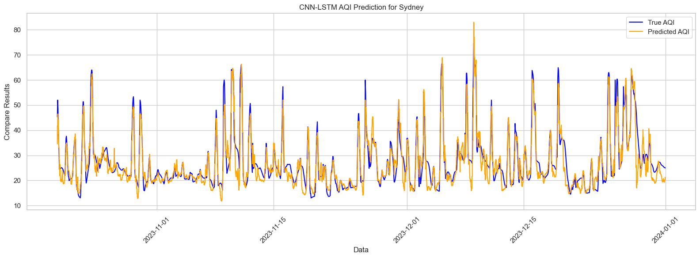
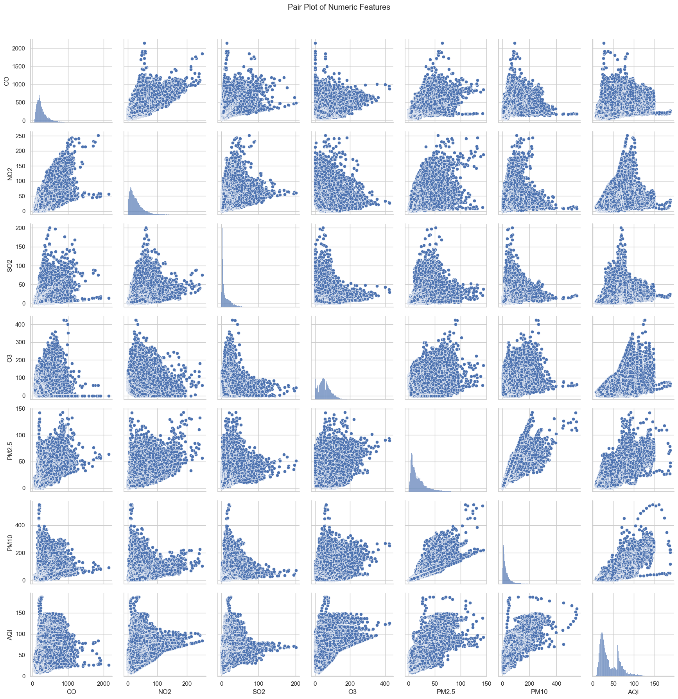

# This project is Data analyze of [Global Air Quality](https://www.kaggle.com/code/devraai/global-air-quality-data-analysis-and-aqi-predic/input?select=London_Air_Quality.csv).

In the code, we achieve the data mining first, and further predict the AQI of different city based on CNN+LSTM.

