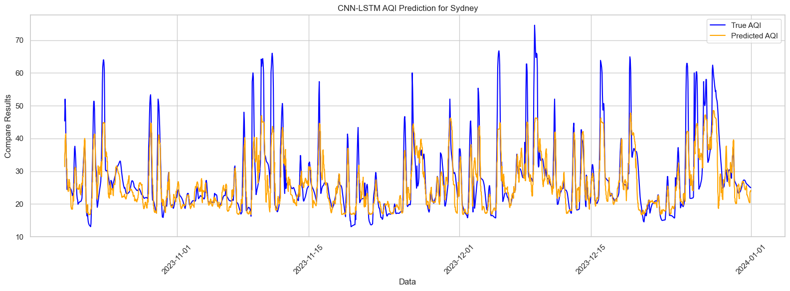

# This project is Data analyze of [Global Air Quality](https://www.kaggle.com/code/devraai/global-air-quality-data-analysis-and-aqi-predic/input?select=London_Air_Quality.csv).

In the code, we achieve the data mining first, and further predict the AQI of different city based on MultiscaleCNN + ResidualLSTM.

## MultiScaleCNN Module is shown as follow,

```python
  class MultiScaleConvBlock(nn.Module):
    def __init__(self, in_channels, out_channels, feature_dim):
      super().__init__()
      self.branch1 = nn.Conv2d(in_channels, out_channels, kernel_size=(1,1), padding=(0,0))
      self.branch2 = nn.Conv2d(in_channels, out_channels, kernel_size=(1,3), padding=(0,1))
      self.branch3 = nn.Conv2d(in_channels, out_channels, kernel_size=(1,5), padding=(0,2))
      self.branch4 = nn.Conv2d(in_channels, out_channels, kernel_size=(1,7), padding=(0,3))
      self.relu = nn.ReLU()

    def forward(self, x):
      x1 = self.branch1(x)
      x2 = self.branch2(x)
      x3 = self.branch3(x)
      x4 = self.branch4(x)
      out = torch.cat([x1, x2, x3, x4], dim=1)
      return self.relu(out)
```

## The model training results are shown below

<div
align="center">

</div>
In the Figure, the minimum of MAE about Train achieves 1.5, MSE achieves 15, the ACC of train achieves 0.99. For validation, the ACC more than 0.97 and $R^{2}$ achieves 0.75.

## The predictions are as follows (Sydney, London, NewYork, Brasilia)

### Sydney

<div
align="center">

</div>


This is the pair plot, is shown the relativity about each feature. The diagonal represents the distribution of each feature. 

### London


This Figure shows the prediction result on London datasets, the predicted curve trend was observed to be consistent with the original data trend. But I forgot to sort the time, so a horizontal line spans the entire image😅.

### NewYork

NewYork-Prediction 

### Brasilia
The prediction ability of the model on Brasilia data set is introduced in the figure.


